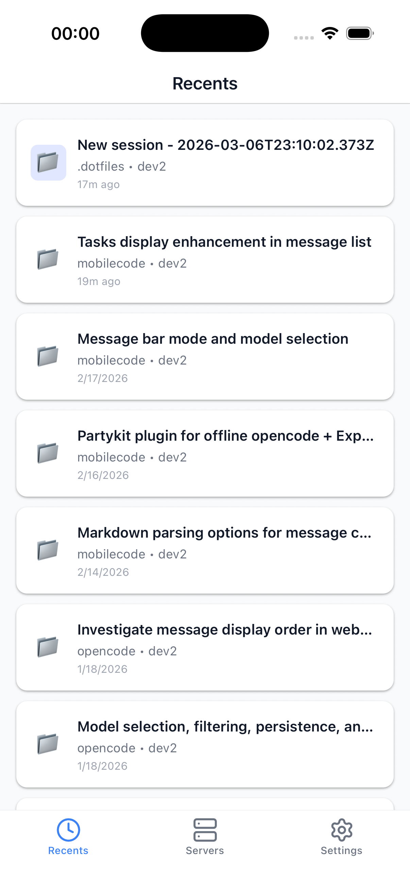
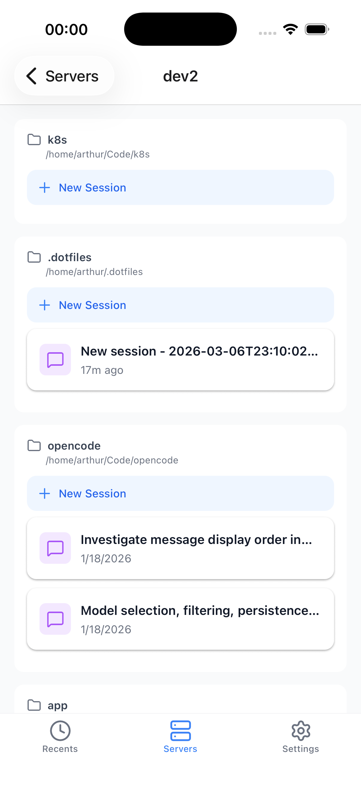
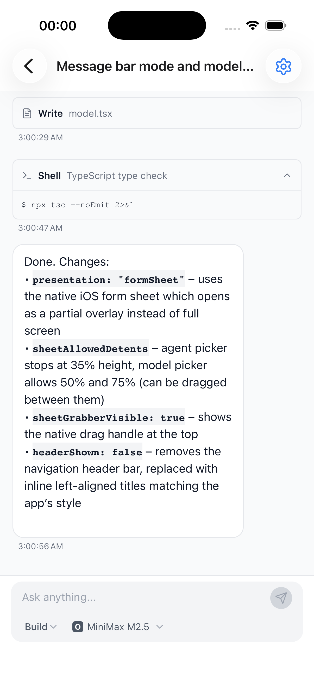

<p align="center">
  
</p>
<p align="center">A mobile client for <a href="https://github.com/anomalyco/opencode">OpenCode</a>.</p>
<p align="center">
  <a href="https://github.com/apuyou/mobilecode/blob/main/LICENSE"></a>
</p>

> [!NOTE]
> This project is **not** built by the OpenCode team and is **not** affiliated with or endorsed by [OpenCode](https://opencode.ai) in any way.

<p align="center">
  <a href="#download"></a>
  <a href="#download"></a>
</p>

---

<p align="center">
  
  &nbsp;&nbsp;
  
  &nbsp;&nbsp;
  
</p>

---

## About

MobileCode lets you control your [OpenCode](https://github.com/anomalyco/opencode) sessions remotely from your phone. Connect to an OpenCode server running on your machine, browse projects and sessions, and chat with the AI coding agent -- all from your pocket.

OpenCode's client/server architecture makes this possible: OpenCode runs on your computer while you drive it from anywhere using MobileCode as a remote client.

## Features

- **Multi-server management** -- connect to multiple OpenCode instances, with built-in connection testing
- **Project browsing** -- browse all projects detected by each OpenCode server
- **Session management** -- list, create, and archive sessions across all your projects
- **Chat interface** -- full conversational UI with Markdown rendering and tool invocation cards
- **Agent and model selection** -- switch between agents and models on the fly
- **Dark mode** -- follows your system theme
- **Over-the-air updates** -- get the latest improvements without waiting for a store release

## Download

<!-- TODO: Replace with actual store links -->

| Platform | Link |
| -------- | ---- |
| iOS      | [App Store](https://apps.apple.com/app/mobilecode/id6757964391) |
| Android  | [Google Play](#) |

## Setup

> [!WARNING]
> Do **not** expose OpenCode to the public Internet without configuring a password!
> See [OpenCode documentation](https://opencode.ai/docs/web/) for all available options.

1. Install and configure [Tailscale]([https://tailscale.com](https://tailscale.com/docs/how-to/quickstart)) on the computer you use for OpenCode as well as your phone
2. Start OpenCode on your machine, listening on its Tailscale IP (you can copy it from the Tailscale app):
   ```bash
   opencode web --hostname=100.x.x.x
   ```
3. Open MobileCode on your phone
4. Add a server with the URL of your machine (e.g. `http://100.x.x.x:4096`)
5. Start coding

## Tech Stack

| Layer            | Technology                         |
| ---------------- | ---------------------------------- |
| Framework        | Expo SDK 55 + expo-router          |
| Language         | TypeScript                         |
| UI               | React Native + NativeWind (Tailwind) |
| State            | Zustand + MMKV persistence         |
| Data Fetching    | TanStack React Query               |
| API Client       | `@opencode-ai/sdk`                 |

## Development

```bash
# Install dependencies
bun install

# Start the development server
bun start

# Run on iOS simulator
bun ios

# Run on Android emulator
bun android
```

## Contributing

Contributions are welcome! Feel free to open issues and pull requests.
